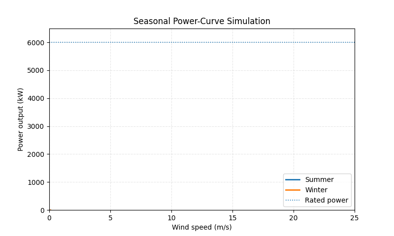
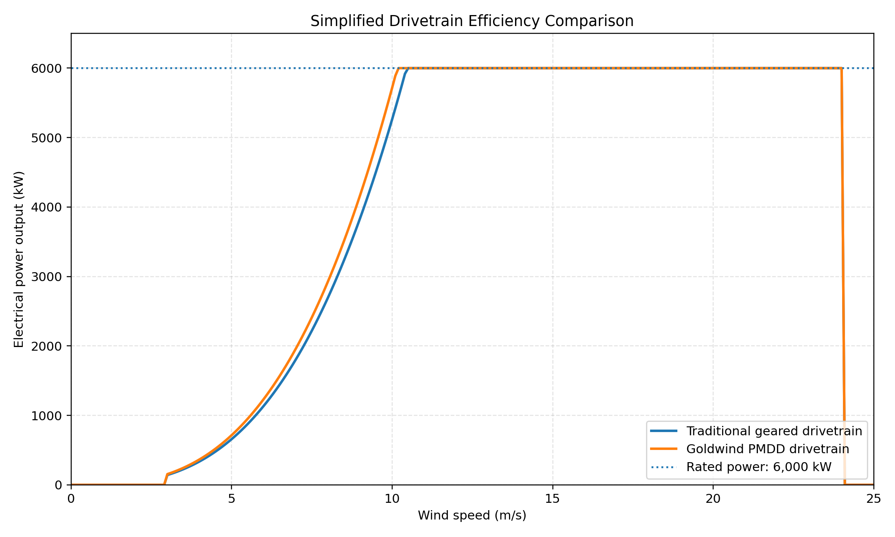
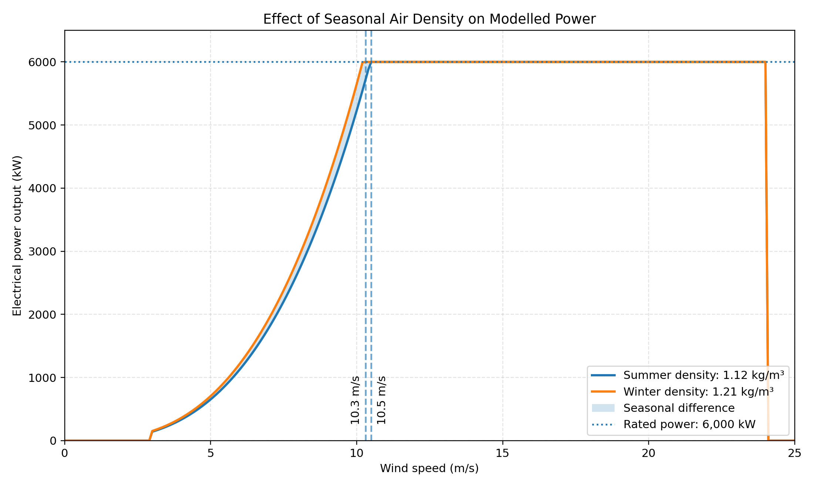
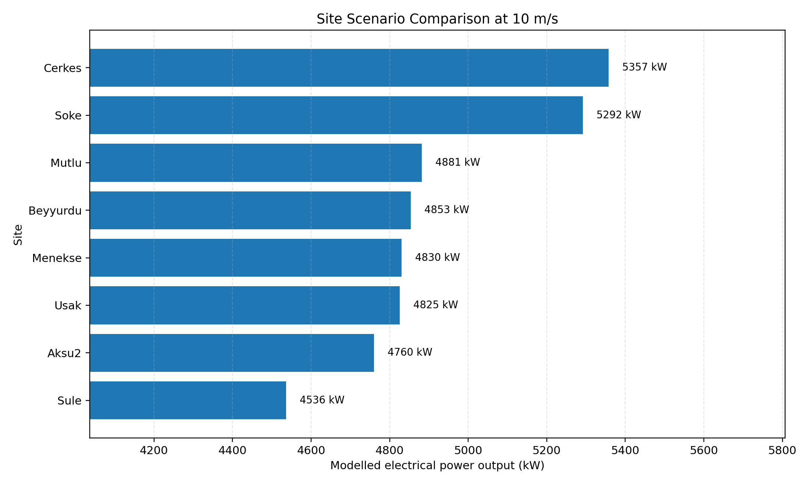

# GW165 Wind Turbine Performance Simulation

A Python project exploring how drivetrain efficiency, seasonal air density, and site conditions can affect the calculated power output of a 6 MW wind turbine.

I developed this project from work and technical materials I reviewed during my internship at Goldwind. I used real turbine-related parameters as inputs, then built a simplified physical model to compare how different variables change the power curve.



## What this project explores

### 1. Traditional drivetrain and PMDD

The first simulation compares a conventional geared drivetrain with Goldwind's permanent-magnet direct-drive (PMDD) system.



The 97% PMDD efficiency value is based on technical material I reviewed during my internship. The geared case uses gearbox and generator efficiency values for comparison.

The efficiency inputs are based on technical information, but the plotted curves are still generated by my simplified equation. They should therefore be understood as modelled results rather than an official measured power curve.

### 2. Summer and winter air density

The second simulation keeps the turbine model unchanged and compares two air-density values. Because denser air contains more kinetic energy at the same wind speed, the winter scenario reaches the 6 MW limit earlier in this simplified model.



### 3. Site scenarios

The third simulation uses site names and air-density values collected for this project. It compares the calculated output at a constant wind speed of 10 m/s.



The chart isolates air density so that its effect is easier to see. A real wind-farm assessment would also need wind-speed distributions, turbulence, terrain, wake effects, temperature profiles, availability, and electrical losses.

## Model

The basic power equation is:

$$P = \frac{1}{2}\rho A v^3 C_p \eta$$

where:

- $\rho$ is air density
- $A$ is rotor swept area
- $v$ is wind speed
- $C_p$ is the power coefficient
- $\eta$ is the drivetrain and electrical-efficiency input

The model uses the 165 m rotor diameter and 6 MW rated power of the Goldwind GW165-6.0MW. It applies a cut-in speed of 3 m/s, limits output at 6,000 kW, and sets output to zero above the cut-out speed. The intermediate curve is calculated from the simplified equation rather than copied from the turbine's official measured power curve.

## Project structure

```text
.
├── README.md
├── wind_model.py
├── compare_drivetrains.py
├── compare_seasons.py
├── compare_sites.py
├── make_demo_gif.py
├── requirements.txt
└── images/
    ├── drivetrain_comparison.png
    ├── seasonal_comparison.png
    ├── site_comparison.png
    └── wind_turbine_demo.gif
```

## Run the simulations

```bash
pip install -r requirements.txt
python compare_drivetrains.py
python compare_seasons.py
python compare_sites.py
```

To recreate the animation:

```bash
python make_demo_gif.py
```

## What I learned

The most useful part of this project was learning how to turn technical information into a model that I could test and visualise. I also learned to distinguish between real input data and modelled output: some parameters came from technical materials, while the final curves were produced by my own simplified calculation.

## Limitations and next steps

This model does not include:

- the turbine's official measured power curve
- changing wind direction or turbulence
- wake losses between turbines
- blade-pitch and control-system behaviour
- downtime and electrical losses
- long-term wind-speed distributions

A useful next step would be to compare the simplified equation with approved SCADA data or an official manufacturer power curve, then examine where and why the results differ.

## Sources

- [Goldwind GW165-5.2/5.6/6.0MW product brochure](https://www.goldwind.com/en/assets/9ebb8f5ae5e7e456f3f7a5059b8b6ef9.pdf)
- Some efficiency and site parameters were taken from technical materials reviewed during my Goldwind internship. The original documents are not reproduced in this repository.

> This is an independent educational project based on my internship learning. It is not an official Goldwind performance tool, and its results should not be used for engineering or commercial decisions.
