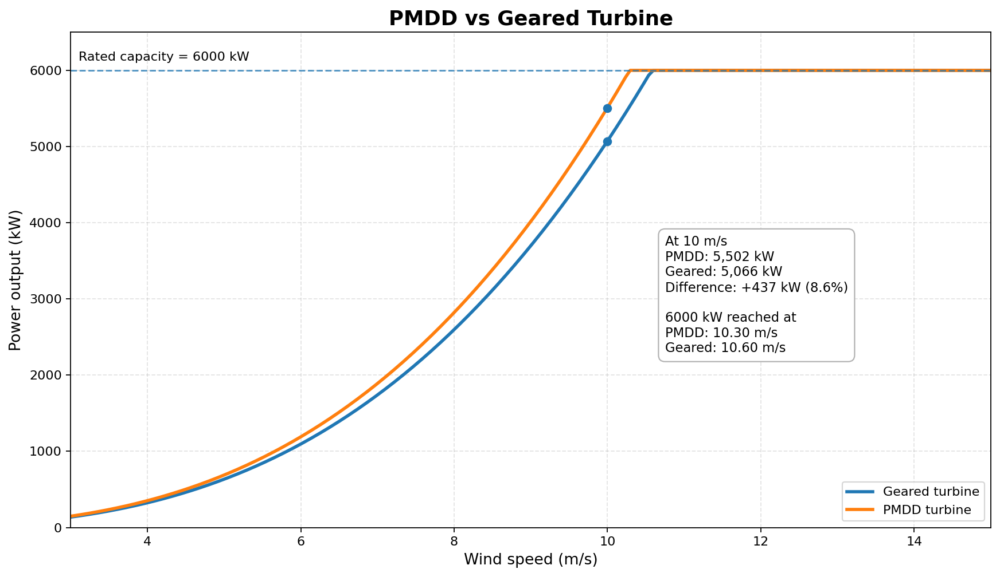
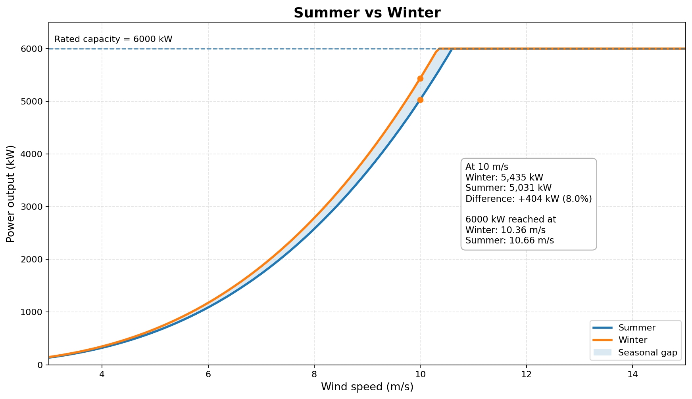
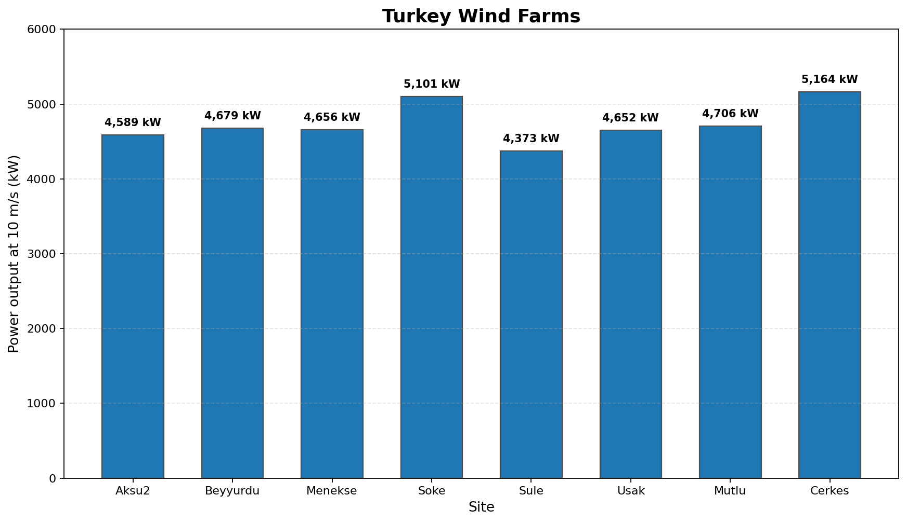

# Goldwind GW165-6.0 Wind Turbine Simulation

A Python-based simulation project exploring how **drivetrain efficiency**, **seasonal air density**, and **site air density** can affect predicted wind-turbine power output.

The project uses the Goldwind **GW165-6.0** as the reference turbine and is based on the standard wind-power relationship:

$$
P=\frac{1}{2}\rho A v^3 C_p \eta
$$

where $\rho$ is air density, $A$ is rotor swept area, $v$ is wind speed, $C_p$ is the power coefficient, and $\eta$ is system efficiency.

## Data and Parameters

Some values in this project come from **technical documents and field-investigation materials** collected during project work, including GW165-series information and site data for wind farms in Turkey.

For parameters that were not available in those materials, I used **public international reference values or simplified modelling assumptions**.

The original field documents are not included in this public repository.

Main modelling values used in the scripts include:

- Rated power: **6000 kW**
- Blade length used in the model: **81 m**
- Power coefficient: **0.45**
- PMDD generator efficiency: **0.97**
- Geared drivetrain efficiency: **0.94 × 0.95**
- Power output is capped at rated capacity

---

## 1. PMDD vs Geared Turbine

This simulation compares a conventional geared drivetrain with a permanent magnet direct-drive (PMDD) system.

At the same wind speed, the PMDD model produces more electrical output because it avoids gearbox losses.

[View Python code](PMDD_vs_Geared.py)

  

---

## 2. Summer vs Winter

This simulation keeps the turbine model unchanged and varies only air density:

- Summer: **1.12 kg/m³**
- Winter: **1.21 kg/m³**

The result shows how denser winter air increases predicted power output and allows the turbine to reach rated power at a slightly lower wind speed.

[View Python code](Summer_vs_Winter.py)

  

---

## 3. Turkey Wind Farms

Eight wind-farm sites are compared at a fixed wind speed of **10 m/s**.

The air-density values used here come from the site dataset in my project materials:

| Site | Air Density (kg/m³) |
|---|---:|
| Aksu2 | 1.020 |
| Beyyurdu | 1.040 |
| Menekse | 1.035 |
| Soke | 1.134 |
| Sule | 0.972 |
| Usak | 1.034 |
| Mutlu | 1.046 |
| Cerkes | 1.148 |

Although the original site materials also contain information such as elevation and turbulence intensity, the current calculation uses **air density only**.

[View Python code](Turkey_Wind_Farms.py)

  

---

## Limitations

This is a simplified educational model rather than an official turbine-performance model. It does not include factors such as wake effects, detailed blade aerodynamics, pitch control, cut-in/cut-out behaviour, or turbulence losses.

